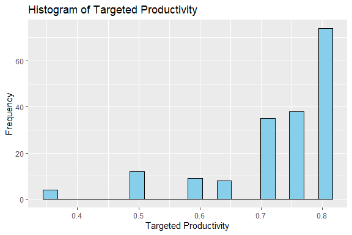
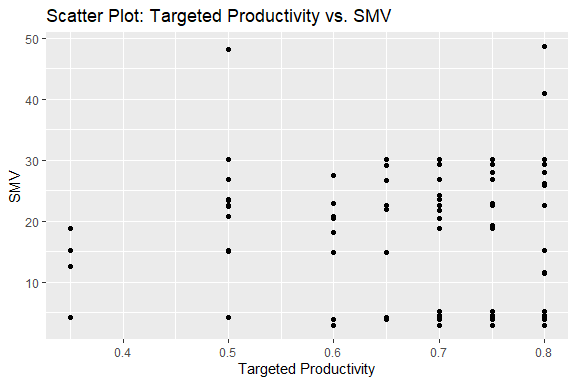

Employee Performance Prediction
================
Trevor Okinda
2024

- [Student Details](#student-details)
- [Setup Chunk](#setup-chunk)
- [Understanding the Dataset (Exploratory Data Analysis
  (EDA))](#understanding-the-dataset-exploratory-data-analysis-eda)
  - [Loading the Dataset](#loading-the-dataset)
    - [Source:](#source)
    - [Reference:](#reference)
- [Exploratory Data Analysis](#exploratory-data-analysis)
  - [Load dataset](#load-dataset)
  - [Measures of frequency](#measures-of-frequency)
  - [Measures of Central Tendency](#measures-of-central-tendency)
  - [Measures of Distribution](#measures-of-distribution)
  - [Measures of Relationship](#measures-of-relationship)
  - [ANOVA](#anova)
  - [Plots](#plots)
- [Preprocessing and Data
  Transformation](#preprocessing-and-data-transformation)
  - [Missing values](#missing-values)
  - [Imputation](#imputation)
- [Training Model](#training-model)
  - [Data Splitting](#data-splitting)
  - [Bootstrapping](#bootstrapping)
  - [Cross-validation](#cross-validation)
  - [Model training](#model-training)
  - [Performance comparison](#performance-comparison)

# Student Details

|                       |                                 |
|-----------------------|---------------------------------|
| **Student ID Number** | 134780                          |
| **Student Name**      | Trevor Okinda                   |
| **BBIT 4.2 Group**    | C                               |
| **Project Name**      | Employee Performance Prediction |

# Setup Chunk

**Note:** the following KnitR options have been set as the global
defaults: <BR>
`knitr::opts_chunk$set(echo = TRUE, warning = FALSE, eval = TRUE, collapse = FALSE, tidy = TRUE)`.

More KnitR options are documented here
<https://bookdown.org/yihui/rmarkdown-cookbook/chunk-options.html> and
here <https://yihui.org/knitr/options/>.

# Understanding the Dataset (Exploratory Data Analysis (EDA))

## Loading the Dataset

### Source:

The dataset that was used can be downloaded here: *\<<a
href="https://www.kaggle.com/datasets/gauravduttakiit/employee-performance-prediction\"
class="uri">https://www.kaggle.com/datasets/gauravduttakiit/employee-performance-prediction\</a>\>*

### Reference:

*\<Avagyan, Z. (2017). Weather CSV \[Data set\]. Kaggle.
<a href="https://www.kaggle.com/datasets/zaraavagyan/weathercsv\"
class="uri">https://www.kaggle.com/datasets/zaraavagyan/weathercsv\</a>\>  
Refer to the APA 7th edition manual for rules on how to cite datasets:
<https://apastyle.apa.org/style-grammar-guidelines/references/examples/data-set-references>*

# Exploratory Data Analysis

## Load dataset

``` r
# Load the employee dataset
employee_data <- read.csv("employee_performance.csv", 
                          colClasses = c(
                            team = "factor",
                            targeted_productivity = "numeric",
                            smv = "numeric",
                            wip = "numeric",
                            over_time = "numeric",
                            incentive = "numeric",
                            idle_time = "numeric",
                            idle_men = "numeric",
                            no_of_style_change = "numeric",
                            no_of_workers = "numeric",
                            month = "factor",
                            quarter_Quarter1 = "factor",
                            quarter_Quarter2 = "factor",
                            quarter_Quarter3 = "factor",
                            quarter_Quarter4 = "factor",
                            quarter_Quarter5 = "factor",
                            day_Friday = "factor",
                            department_finishing  = "factor", 
                            department_sewing = "factor",  
                            day_Monday = "factor",
                            day_Saturday = "factor",
                            day_Sunday = "factor",
                            day_Thursday = "factor",
                            day_Tuesday = "factor",
                            day_Wednesday = "factor"
                          ), 
                          header = TRUE)

# Display the structure of the dataset
str(employee_data)
```

    ## 'data.frame':    180 obs. of  25 variables:
    ##  $ team                 : Factor w/ 12 levels "1","10","11",..: 4 7 6 10 8 1 10 4 7 12 ...
    ##  $ targeted_productivity: num  0.75 0.75 0.7 0.7 0.5 0.75 0.75 0.75 0.75 0.8 ...
    ##  $ smv                  : num  4.08 4.15 30.1 3.94 4.15 ...
    ##  $ wip                  : num  NA NA 1057 NA NA ...
    ##  $ over_time            : num  1080 2400 0 2160 1440 6960 6960 1080 6840 1440 ...
    ##  $ incentive            : num  0 0 40 0 0 81 45 0 65 0 ...
    ##  $ idle_time            : num  0 0 0 0 0 0 0 0 0 0 ...
    ##  $ idle_men             : num  0 0 0 0 0 0 0 0 0 0 ...
    ##  $ no_of_style_change   : num  0 0 1 0 0 0 1 0 0 0 ...
    ##  $ no_of_workers        : num  9 20 58 18 8 58 58 9 57 8 ...
    ##  $ month                : Factor w/ 3 levels "1","2","3": 1 2 2 2 1 1 2 2 3 1 ...
    ##  $ quarter_Quarter1     : Factor w/ 2 levels "0","1": 1 1 1 2 1 1 1 2 1 2 ...
    ##  $ quarter_Quarter2     : Factor w/ 2 levels "0","1": 1 1 1 1 2 1 1 1 2 1 ...
    ##  $ quarter_Quarter3     : Factor w/ 2 levels "0","1": 1 2 2 1 1 1 1 1 1 1 ...
    ##  $ quarter_Quarter4     : Factor w/ 2 levels "0","1": 1 1 1 1 1 1 2 1 1 1 ...
    ##  $ quarter_Quarter5     : Factor w/ 2 levels "0","1": 2 1 1 1 1 2 1 1 1 1 ...
    ##  $ day_Friday           : Factor w/ 2 levels "0","1": 1 2 1 1 1 1 1 1 1 1 ...
    ##  $ department_finishing : Factor w/ 2 levels "0","1": 2 1 1 2 2 1 1 2 1 2 ...
    ##  $ department_sewing    : Factor w/ 2 levels "0","1": 1 1 2 1 1 2 2 1 2 1 ...
    ##  $ day_Monday           : Factor w/ 2 levels "0","1": 1 1 1 1 1 1 2 1 1 1 ...
    ##  $ day_Saturday         : Factor w/ 2 levels "0","1": 2 1 1 1 1 2 1 1 1 1 ...
    ##  $ day_Sunday           : Factor w/ 2 levels "0","1": 1 2 1 2 2 1 1 2 2 1 ...
    ##  $ day_Thursday         : Factor w/ 2 levels "0","1": 1 1 1 1 1 1 1 1 1 1 ...
    ##  $ day_Tuesday          : Factor w/ 2 levels "0","1": 1 1 1 1 1 1 1 1 1 1 ...
    ##  $ day_Wednesday        : Factor w/ 2 levels "0","1": 1 1 2 1 1 1 1 1 1 2 ...

``` r
# View the first few rows of the dataset
head(employee_data)
```

    ##   team targeted_productivity   smv  wip over_time incentive idle_time idle_men
    ## 1   12                  0.75  4.08   NA      1080         0         0        0
    ## 2    4                  0.75  4.15   NA      2400         0         0        0
    ## 3    3                  0.70 30.10 1057         0        40         0        0
    ## 4    7                  0.70  3.94   NA      2160         0         0        0
    ## 5    5                  0.50  4.15   NA      1440         0         0        0
    ## 6    1                  0.75 22.94 1502      6960        81         0        0
    ##   no_of_style_change no_of_workers month quarter_Quarter1 quarter_Quarter2
    ## 1                  0             9     1                0                0
    ## 2                  0            20     2                0                0
    ## 3                  1            58     2                0                0
    ## 4                  0            18     2                1                0
    ## 5                  0             8     1                0                1
    ## 6                  0            58     1                0                0
    ##   quarter_Quarter3 quarter_Quarter4 quarter_Quarter5 day_Friday
    ## 1                0                0                1          0
    ## 2                1                0                0          1
    ## 3                1                0                0          0
    ## 4                0                0                0          0
    ## 5                0                0                0          0
    ## 6                0                0                1          0
    ##   department_finishing department_sewing day_Monday day_Saturday day_Sunday
    ## 1                    1                 0          0            1          0
    ## 2                    0                 0          0            0          1
    ## 3                    0                 1          0            0          0
    ## 4                    1                 0          0            0          1
    ## 5                    1                 0          0            0          1
    ## 6                    0                 1          0            1          0
    ##   day_Thursday day_Tuesday day_Wednesday
    ## 1            0           0             0
    ## 2            0           0             0
    ## 3            0           0             1
    ## 4            0           0             0
    ## 5            0           0             0
    ## 6            0           0             0

``` r
# View the dataset
View(employee_data)
```

## Measures of frequency

``` r
# Frequency table for the 'team' variable
team_freq <- table(employee_data$team)
print("Frequency table for 'team' variable:")
```

    ## [1] "Frequency table for 'team' variable:"

``` r
print(team_freq)
```

    ## 
    ##  1 10 11 12  2  3  4  5  6  7  8  9 
    ## 19 14  9 17 12 10 20 19 14 16 17 13

``` r
# Frequency table for the 'department_finishing' variable
dept_finishing_freq <- table(employee_data$department_finishing)
print("Frequency table for 'department_finishing' variable:")
```

    ## [1] "Frequency table for 'department_finishing' variable:"

``` r
print(dept_finishing_freq)
```

    ## 
    ##   0   1 
    ## 141  39

``` r
# Frequency table for the 'day_Monday' variable
day_Monday_freq <- table(employee_data$day_Monday)
print("Frequency table for 'day_Monday' variable:")
```

    ## [1] "Frequency table for 'day_Monday' variable:"

``` r
print(day_Monday_freq)
```

    ## 
    ##   0   1 
    ## 145  35

## Measures of Central Tendency

``` r
# Calculate measures of central tendency for numerical variables

# Mean
mean_targeted_productivity <- mean(employee_data$targeted_productivity)
mean_smv <- mean(employee_data$smv)
mean_wip <- mean(employee_data$wip)
mean_over_time <- mean(employee_data$over_time)
mean_incentive <- mean(employee_data$incentive)
mean_idle_time <- mean(employee_data$idle_time)
mean_idle_men <- mean(employee_data$idle_men)
mean_no_of_style_change <- mean(employee_data$no_of_style_change)
mean_no_of_workers <- mean(employee_data$no_of_workers)

# Median
median_targeted_productivity <- median(employee_data$targeted_productivity)
median_smv <- median(employee_data$smv)
median_wip <- median(employee_data$wip)
median_over_time <- median(employee_data$over_time)
median_incentive <- median(employee_data$incentive)
median_idle_time <- median(employee_data$idle_time)
median_idle_men <- median(employee_data$idle_men)
median_no_of_style_change <- median(employee_data$no_of_style_change)
median_no_of_workers <- median(employee_data$no_of_workers)

# Mode (assuming there's only one mode)
mode_targeted_productivity <- names(sort(table(employee_data$targeted_productivity), decreasing = TRUE)[1])
mode_smv <- names(sort(table(employee_data$smv), decreasing = TRUE)[1])
mode_wip <- names(sort(table(employee_data$wip), decreasing = TRUE)[1])
mode_over_time <- names(sort(table(employee_data$over_time), decreasing = TRUE)[1])
mode_incentive <- names(sort(table(employee_data$incentive), decreasing = TRUE)[1])
mode_idle_time <- names(sort(table(employee_data$idle_time), decreasing = TRUE)[1])
mode_idle_men <- names(sort(table(employee_data$idle_men), decreasing = TRUE)[1])
mode_no_of_style_change <- names(sort(table(employee_data$no_of_style_change), decreasing = TRUE)[1])
mode_no_of_workers <- names(sort(table(employee_data$no_of_workers), decreasing = TRUE)[1])

# Print the results
cat("Mean targeted_productivity:", mean_targeted_productivity, "\n")
```

    ## Mean targeted_productivity: 0.7233333

``` r
cat("Median targeted_productivity:", median_targeted_productivity, "\n")
```

    ## Median targeted_productivity: 0.75

``` r
cat("Mode targeted_productivity:", mode_targeted_productivity, "\n")
```

    ## Mode targeted_productivity: 0.8

``` r
cat("Mean smv:", mean_smv, "\n")
```

    ## Mean smv: 14.56317

``` r
cat("Median smv:", median_smv, "\n")
```

    ## Median smv: 14.99

``` r
cat("Mode smv:", mode_smv, "\n")
```

    ## Mode smv: 3.94

``` r
cat("Mean wip:", mean_wip, "\n")
```

    ## Mean wip: NA

``` r
cat("Median wip:", median_wip, "\n")
```

    ## Median wip: NA

``` r
cat("Mode wip:", mode_wip, "\n")
```

    ## Mode wip: 610

``` r
cat("Mean over_time:", mean_over_time, "\n")
```

    ## Mean over_time: 4762.5

``` r
cat("Median over_time:", median_over_time, "\n")
```

    ## Median over_time: 3600

``` r
cat("Mode over_time:", mode_over_time, "\n")
```

    ## Mode over_time: 1440

``` r
cat("Mean incentive:", mean_incentive, "\n")
```

    ## Mean incentive: 24.20556

``` r
cat("Median incentive:", median_incentive, "\n")
```

    ## Median incentive: 0

``` r
cat("Mode incentive:", mode_incentive, "\n")
```

    ## Mode incentive: 0

``` r
cat("Mean idle_time:", mean_idle_time, "\n")
```

    ## Mean idle_time: 1.666667

``` r
cat("Median idle_time:", median_idle_time, "\n")
```

    ## Median idle_time: 0

``` r
cat("Mode idle_time:", mode_idle_time, "\n")
```

    ## Mode idle_time: 0

``` r
cat("Mean idle_men:", mean_idle_men, "\n")
```

    ## Mean idle_men: 0.2055556

``` r
cat("Median idle_men:", median_idle_men, "\n")
```

    ## Median idle_men: 0

``` r
cat("Mode idle_men:", mode_idle_men, "\n")
```

    ## Mode idle_men: 0

``` r
cat("Mean no_of_style_change:", mean_no_of_style_change, "\n")
```

    ## Mean no_of_style_change: 0.09444444

``` r
cat("Median no_of_style_change:", median_no_of_style_change, "\n")
```

    ## Median no_of_style_change: 0

``` r
cat("Mode no_of_style_change:", mode_no_of_style_change, "\n")
```

    ## Mode no_of_style_change: 0

``` r
cat("Mean no_of_workers:", mean_no_of_workers, "\n")
```

    ## Mean no_of_workers: 33.275

``` r
cat("Median no_of_workers:", median_no_of_workers, "\n")
```

    ## Median no_of_workers: 33

``` r
cat("Mode no_of_workers:", mode_no_of_workers, "\n")
```

    ## Mode no_of_workers: 8

## Measures of Distribution

``` r
# Load the psych package
library(psych)

# Calculate measures of distribution for numerical variables

# Variance
variance_targeted_productivity <- var(employee_data$targeted_productivity)
variance_smv <- var(employee_data$smv)
variance_wip <- var(employee_data$wip)
variance_over_time <- var(employee_data$over_time)
variance_incentive <- var(employee_data$incentive)
variance_idle_time <- var(employee_data$idle_time)
variance_idle_men <- var(employee_data$idle_men)
variance_no_of_style_change <- var(employee_data$no_of_style_change)
variance_no_of_workers <- var(employee_data$no_of_workers)

# Standard Deviation
sd_targeted_productivity <- sd(employee_data$targeted_productivity)
sd_smv <- sd(employee_data$smv)
sd_wip <- sd(employee_data$wip)
sd_over_time <- sd(employee_data$over_time)
sd_incentive <- sd(employee_data$incentive)
sd_idle_time <- sd(employee_data$idle_time)
sd_idle_men <- sd(employee_data$idle_men)
sd_no_of_style_change <- sd(employee_data$no_of_style_change)
sd_no_of_workers <- sd(employee_data$no_of_workers)

# Skewness
skewness_targeted_productivity <- skew(employee_data$targeted_productivity)
skewness_smv <- skew(employee_data$smv)
skewness_wip <- skew(employee_data$wip)
skewness_over_time <- skew(employee_data$over_time)
skewness_incentive <- skew(employee_data$incentive)
skewness_idle_time <- skew(employee_data$idle_time)
skewness_idle_men <- skew(employee_data$idle_men)
skewness_no_of_style_change <- skew(employee_data$no_of_style_change)
skewness_no_of_workers <- skew(employee_data$no_of_workers)

# Print the results
cat("Variance targeted_productivity:", variance_targeted_productivity, "\n")
```

    ## Variance targeted_productivity: 0.01015084

``` r
cat("Standard Deviation targeted_productivity:", sd_targeted_productivity, "\n")
```

    ## Standard Deviation targeted_productivity: 0.1007514

``` r
cat("Skewness targeted_productivity:", skewness_targeted_productivity, "\n")
```

    ## Skewness targeted_productivity: -1.782988

``` r
cat("Variance smv:", variance_smv, "\n")
```

    ## Variance smv: 119.7709

``` r
cat("Standard Deviation smv:", sd_smv, "\n")
```

    ## Standard Deviation smv: 10.94399

``` r
cat("Skewness smv:", skewness_smv, "\n")
```

    ## Skewness smv: 0.4653244

``` r
cat("Variance wip:", variance_wip, "\n")
```

    ## Variance wip: NA

``` r
cat("Standard Deviation wip:", sd_wip, "\n")
```

    ## Standard Deviation wip: NA

``` r
cat("Skewness wip:", skewness_wip, "\n")
```

    ## Skewness wip: 9.168393

``` r
cat("Variance over_time:", variance_over_time, "\n")
```

    ## Variance over_time: 13970684

``` r
cat("Standard Deviation over_time:", sd_over_time, "\n")
```

    ## Standard Deviation over_time: 3737.738

``` r
cat("Skewness over_time:", skewness_over_time, "\n")
```

    ## Skewness over_time: 1.328817

``` r
cat("Variance incentive:", variance_incentive, "\n")
```

    ## Variance incentive: 857.3486

``` r
cat("Standard Deviation incentive:", sd_incentive, "\n")
```

    ## Standard Deviation incentive: 29.28052

``` r
cat("Skewness incentive:", skewness_incentive, "\n")
```

    ## Skewness incentive: 0.8303177

``` r
cat("Variance idle_time:", variance_idle_time, "\n")
```

    ## Variance idle_time: 500

``` r
cat("Standard Deviation idle_time:", sd_idle_time, "\n")
```

    ## Standard Deviation idle_time: 22.36068

``` r
cat("Skewness idle_time:", skewness_idle_time, "\n")
```

    ## Skewness idle_time: 13.19363

``` r
cat("Variance idle_men:", variance_idle_men, "\n")
```

    ## Variance idle_men: 7.605556

``` r
cat("Standard Deviation idle_men:", sd_idle_men, "\n")
```

    ## Standard Deviation idle_men: 2.757817

``` r
cat("Skewness idle_men:", skewness_idle_men, "\n")
```

    ## Skewness idle_men: 13.19363

``` r
cat("Variance no_of_style_change:", variance_no_of_style_change, "\n")
```

    ## Variance no_of_style_change: 0.119522

``` r
cat("Standard Deviation no_of_style_change:", sd_no_of_style_change, "\n")
```

    ## Standard Deviation no_of_style_change: 0.3457196

``` r
cat("Skewness no_of_style_change:", skewness_no_of_style_change, "\n")
```

    ## Skewness no_of_style_change: 3.870312

``` r
cat("Variance no_of_workers:", variance_no_of_workers, "\n")
```

    ## Variance no_of_workers: 496.5036

``` r
cat("Standard Deviation no_of_workers:", sd_no_of_workers, "\n")
```

    ## Standard Deviation no_of_workers: 22.28236

``` r
cat("Skewness no_of_workers:", skewness_no_of_workers, "\n")
```

    ## Skewness no_of_workers: 0.01085008

## Measures of Relationship

``` r
# Calculate correlation matrix for numerical variables
correlation_matrix <- cor(employee_data[, c(
  "targeted_productivity", "smv", "wip", "over_time",
  "incentive", "idle_time", "idle_men", "no_of_style_change",
  "no_of_workers"
)])

# Print correlation matrix
print("Correlation Matrix:")
```

    ## [1] "Correlation Matrix:"

``` r
print(correlation_matrix)
```

    ##                       targeted_productivity         smv wip   over_time
    ## targeted_productivity            1.00000000 -0.10772342  NA -0.18075691
    ## smv                             -0.10772342  1.00000000  NA  0.64733308
    ## wip                                      NA          NA   1          NA
    ## over_time                       -0.18075691  0.64733308  NA  1.00000000
    ## incentive                        0.15412411  0.69344769  NA  0.57584523
    ## idle_time                       -0.01735837  0.06641061  NA  0.04165963
    ## idle_men                        -0.01735837  0.06641061  NA  0.04165963
    ## no_of_style_change              -0.09569821  0.33689808  NA  0.07564673
    ## no_of_workers                   -0.12978688  0.92225577  NA  0.74172378
    ##                         incentive   idle_time    idle_men no_of_style_change
    ## targeted_productivity  0.15412411 -0.01735837 -0.01735837        -0.09569821
    ## smv                    0.69344769  0.06641061  0.06641061         0.33689808
    ## wip                            NA          NA          NA                 NA
    ## over_time              0.57584523  0.04165963  0.04165963         0.07564673
    ## incentive              1.00000000 -0.06196116 -0.06196116         0.11175867
    ## idle_time             -0.06196116  1.00000000  1.00000000        -0.02047555
    ## idle_men              -0.06196116  1.00000000  1.00000000        -0.02047555
    ## no_of_style_change     0.11175867 -0.02047555 -0.02047555         1.00000000
    ## no_of_workers          0.76319409  0.07980466  0.07980466         0.28089068
    ##                       no_of_workers
    ## targeted_productivity   -0.12978688
    ## smv                      0.92225577
    ## wip                              NA
    ## over_time                0.74172378
    ## incentive                0.76319409
    ## idle_time                0.07980466
    ## idle_men                 0.07980466
    ## no_of_style_change       0.28089068
    ## no_of_workers            1.00000000

## ANOVA

``` r
# Fit ANOVA model
anova_result <- aov(targeted_productivity ~ day_Monday + day_Tuesday + day_Wednesday + 
                      day_Thursday + day_Friday + day_Saturday + day_Sunday, data = employee_data)

# Summary of ANOVA
summary(anova_result)
```

    ##                Df Sum Sq Mean Sq F value Pr(>F)  
    ## day_Monday      1 0.0019 0.00193   0.196 0.6587  
    ## day_Tuesday     1 0.0399 0.03992   4.048 0.0458 *
    ## day_Wednesday   1 0.0008 0.00081   0.082 0.7749  
    ## day_Thursday    1 0.0227 0.02268   2.300 0.1312  
    ## day_Friday      1 0.0432 0.04321   4.382 0.0378 *
    ## day_Saturday    1 0.0022 0.00220   0.223 0.6376  
    ## Residuals     173 1.7062 0.00986                 
    ## ---
    ## Signif. codes:  0 '***' 0.001 '**' 0.01 '*' 0.05 '.' 0.1 ' ' 1

## Plots

``` r
# Load necessary packages for plotting
library(ggplot2)
```

    ## 
    ## Attaching package: 'ggplot2'

    ## The following objects are masked from 'package:psych':
    ## 
    ##     %+%, alpha

``` r
# Histogram for targeted_productivity
histogram_targeted_productivity <- ggplot(employee_data, aes(x = targeted_productivity)) +
  geom_histogram(fill = "skyblue", color = "black", bins = 20) +
  labs(title = "Histogram of Targeted Productivity",
       x = "Targeted Productivity",
       y = "Frequency")

# Boxplot for smv
boxplot_smv <- ggplot(employee_data, aes(y = smv)) +
  geom_boxplot(fill = "lightgreen", color = "black") +
  labs(title = "Boxplot of SMV",
       y = "SMV")

# Density plot for wipss
density_wip <- ggplot(employee_data, aes(x = wip)) +
  geom_density(fill = "pink", color = "black") +
  labs(title = "Density Plot of WIP",
       x = "WIP",
       y = "Density")

# Output each plot
print(histogram_targeted_productivity)
```

<!-- -->

``` r
print(boxplot_smv)
```

<!-- -->

``` r
print(density_wip)
```

<!-- -->

``` r
# Multivariate plots

# Scatter plot between targeted_productivity and smv
scatter_targeted_smv <- ggplot(employee_data, aes(x = targeted_productivity, y = smv)) +
  geom_point() +
  labs(title = "Scatter Plot: Targeted Productivity vs. SMV",
       x = "Targeted Productivity",
       y = "SMV")

# Scatter plot between wip and over_time colored by department_finishing
scatter_wip_over_time <- ggplot(employee_data, aes(x = wip, y = over_time, color = department_finishing)) +
  geom_point() +
  labs(title = "Scatter Plot: WIP vs. Overtime",
       x = "WIP",
       y = "Overtime")

# Boxplot of targeted_productivity by day_Monday
boxplot_targeted_day <- ggplot(employee_data, aes(x = day_Monday, y = targeted_productivity)) +
  geom_boxplot() +
  labs(title = "Boxplot: Targeted Productivity by Day (Monday)",
       x = "Day of Week",
       y = "Targeted Productivity")

# Output each plot
print(scatter_targeted_smv)
```

<!-- -->

``` r
print(scatter_wip_over_time)
```

<!-- -->

``` r
print(boxplot_targeted_day)
```

<!-- -->

# Preprocessing and Data Transformation

## Missing values

``` r
# Ensure 'team' and 'month' are removed from both training and prediction data
employee_data <- employee_data[, !colnames(employee_data) %in% c("team", "month")]


# Check for missing values
missing_values <- colSums(is.na(employee_data))

# Print the number of missing values for each variable
print("Missing values in the dataset:")
```

    ## [1] "Missing values in the dataset:"

``` r
print(missing_values)
```

    ## targeted_productivity                   smv                   wip 
    ##                     0                     0                    83 
    ##             over_time             incentive             idle_time 
    ##                     0                     0                     0 
    ##              idle_men    no_of_style_change         no_of_workers 
    ##                     0                     0                     0 
    ##      quarter_Quarter1      quarter_Quarter2      quarter_Quarter3 
    ##                     0                     0                     0 
    ##      quarter_Quarter4      quarter_Quarter5            day_Friday 
    ##                     0                     0                     0 
    ##  department_finishing     department_sewing            day_Monday 
    ##                     0                     0                     0 
    ##          day_Saturday            day_Sunday          day_Thursday 
    ##                     0                     0                     0 
    ##           day_Tuesday         day_Wednesday 
    ##                     0                     0

## Imputation

``` r
employee_data$wip[is.na(employee_data$wip)] <- mean(employee_data$wip, na.rm = TRUE)

# Check if there are still missing values
missing_values <- colSums(is.na(employee_data))

# Print the number of missing values for each variable after imputation
print("Missing values in the dataset after imputation:")
```

    ## [1] "Missing values in the dataset after imputation:"

``` r
print(missing_values)
```

    ## targeted_productivity                   smv                   wip 
    ##                     0                     0                     0 
    ##             over_time             incentive             idle_time 
    ##                     0                     0                     0 
    ##              idle_men    no_of_style_change         no_of_workers 
    ##                     0                     0                     0 
    ##      quarter_Quarter1      quarter_Quarter2      quarter_Quarter3 
    ##                     0                     0                     0 
    ##      quarter_Quarter4      quarter_Quarter5            day_Friday 
    ##                     0                     0                     0 
    ##  department_finishing     department_sewing            day_Monday 
    ##                     0                     0                     0 
    ##          day_Saturday            day_Sunday          day_Thursday 
    ##                     0                     0                     0 
    ##           day_Tuesday         day_Wednesday 
    ##                     0                     0

# Training Model

## Data Splitting

``` r
# Load necessary packages
library(caTools)  # For data splitting

# Set seed for reproducibility
set.seed(123)

# Split the data into training and testing sets (70% training, 30% testing)
split <- sample.split(employee_data$targeted_productivity, SplitRatio = 0.7)

# Create training and testing datasets
training_data <- subset(employee_data, split == TRUE)
testing_data <- subset(employee_data, split == FALSE)

# Check the dimensions of the training and testing datasets
cat("Training data dimensions:", dim(training_data), "\n")
```

    ## Training data dimensions: 126 23

``` r
cat("Testing data dimensions:", dim(testing_data), "\n")
```

    ## Testing data dimensions: 54 23

## Bootstrapping

``` r
# Load necessary packages
library(boot)
```

    ## 
    ## Attaching package: 'boot'

    ## The following object is masked from 'package:psych':
    ## 
    ##     logit

``` r
# For example, let's calculate the mean of 'targeted_productivity'
statistic <- function(data, i) {
  mean(data$targeted_productivity[i])
}

# Perform bootstrapping with 1000 bootstrap samples
boot_results <- boot(employee_data, statistic, R = 1000)

# Summarize bootstrapping results
print("Bootstrapping results:")
```

    ## [1] "Bootstrapping results:"

``` r
print(boot_results)
```

    ## 
    ## ORDINARY NONPARAMETRIC BOOTSTRAP
    ## 
    ## 
    ## Call:
    ## boot(data = employee_data, statistic = statistic, R = 1000)
    ## 
    ## 
    ## Bootstrap Statistics :
    ##      original       bias    std. error
    ## t1* 0.7233333 0.0001944444 0.007456564

``` r
# Plot the bootstrap distribution
plot(boot_results)
```

<!-- -->

## Cross-validation

``` r
# Load necessary packages
library(caret)
```

    ## Loading required package: lattice

    ## 
    ## Attaching package: 'lattice'

    ## The following object is masked from 'package:boot':
    ## 
    ##     melanoma

``` r
# Set the seed for reproducibility
set.seed(123)

# Define the number of folds
k <- 10  # You can choose any value depending on your preference and dataset size

# Define the training control
train_control <- trainControl(method = "cv", number = k)

# Define the model (example: linear regression)
model <- train(targeted_productivity ~ ., data = employee_data, method = "lm", trControl = train_control)

# Print the model
print(model)
```

    ## Linear Regression 
    ## 
    ## 180 samples
    ##  22 predictor
    ## 
    ## No pre-processing
    ## Resampling: Cross-Validated (10 fold) 
    ## Summary of sample sizes: 161, 163, 162, 162, 161, 163, ... 
    ## Resampling results:
    ## 
    ##   RMSE       Rsquared   MAE       
    ##   0.1030036  0.1681107  0.07480304
    ## 
    ## Tuning parameter 'intercept' was held constant at a value of TRUE

``` r
# Summarize the results
summary(model)
```

    ## 
    ## Call:
    ## lm(formula = .outcome ~ ., data = dat)
    ## 
    ## Residuals:
    ##      Min       1Q   Median       3Q      Max 
    ## -0.35836 -0.03634  0.01486  0.05495  0.18790 
    ## 
    ## Coefficients: (4 not defined because of singularities)
    ##                         Estimate Std. Error t value Pr(>|t|)    
    ## (Intercept)            5.169e-01  6.890e-02   7.503 4.00e-12 ***
    ## smv                    2.371e-03  1.633e-03   1.452  0.14845    
    ## wip                   -2.756e-06  4.395e-06  -0.627  0.53150    
    ## over_time             -8.197e-06  2.840e-06  -2.887  0.00443 ** 
    ## incentive              2.549e-03  3.755e-04   6.788 2.07e-10 ***
    ## idle_time              2.170e-04  3.034e-04   0.715  0.47546    
    ## idle_men                      NA         NA      NA       NA    
    ## no_of_style_change    -1.189e-02  2.166e-02  -0.549  0.58363    
    ## no_of_workers          1.054e-03  1.259e-03   0.837  0.40404    
    ## quarter_Quarter11      2.792e-02  3.787e-02   0.737  0.46205    
    ## quarter_Quarter21     -5.274e-03  3.905e-02  -0.135  0.89274    
    ## quarter_Quarter31      1.121e-02  3.872e-02   0.289  0.77266    
    ## quarter_Quarter41     -1.255e-02  3.920e-02  -0.320  0.74936    
    ## quarter_Quarter51             NA         NA      NA       NA    
    ## day_Friday1            2.055e-01  4.554e-02   4.513 1.23e-05 ***
    ## department_finishing1  1.917e-01  4.555e-02   4.209 4.25e-05 ***
    ## department_sewing1            NA         NA      NA       NA    
    ## day_Monday1            1.141e-02  2.501e-02   0.456  0.64879    
    ## day_Saturday1          3.033e-02  2.728e-02   1.112  0.26792    
    ## day_Sunday1            2.155e-02  2.527e-02   0.853  0.39488    
    ## day_Thursday1          5.037e-02  2.642e-02   1.907  0.05832 .  
    ## day_Tuesday1          -1.582e-02  2.729e-02  -0.580  0.56295    
    ## day_Wednesday1                NA         NA      NA       NA    
    ## ---
    ## Signif. codes:  0 '***' 0.001 '**' 0.01 '*' 0.05 '.' 0.1 ' ' 1
    ## 
    ## Residual standard error: 0.08623 on 161 degrees of freedom
    ## Multiple R-squared:  0.3412, Adjusted R-squared:  0.2676 
    ## F-statistic: 4.633 on 18 and 161 DF,  p-value: 3.892e-08

## Model training

``` r
# Load necessary packages
library(caret)

# Define the model using linear regression
model_lm <- train(targeted_productivity ~ ., data = employee_data, method = "lm")

# Print the model
print(model_lm)
```

    ## Linear Regression 
    ## 
    ## 180 samples
    ##  22 predictor
    ## 
    ## No pre-processing
    ## Resampling: Bootstrapped (25 reps) 
    ## Summary of sample sizes: 180, 180, 180, 180, 180, 180, ... 
    ## Resampling results:
    ## 
    ##   RMSE       Rsquared    MAE       
    ##   0.1474269  0.08995974  0.08543686
    ## 
    ## Tuning parameter 'intercept' was held constant at a value of TRUE

``` r
# Summarize the results
summary(model_lm)
```

    ## 
    ## Call:
    ## lm(formula = .outcome ~ ., data = dat)
    ## 
    ## Residuals:
    ##      Min       1Q   Median       3Q      Max 
    ## -0.35836 -0.03634  0.01486  0.05495  0.18790 
    ## 
    ## Coefficients: (4 not defined because of singularities)
    ##                         Estimate Std. Error t value Pr(>|t|)    
    ## (Intercept)            5.169e-01  6.890e-02   7.503 4.00e-12 ***
    ## smv                    2.371e-03  1.633e-03   1.452  0.14845    
    ## wip                   -2.756e-06  4.395e-06  -0.627  0.53150    
    ## over_time             -8.197e-06  2.840e-06  -2.887  0.00443 ** 
    ## incentive              2.549e-03  3.755e-04   6.788 2.07e-10 ***
    ## idle_time              2.170e-04  3.034e-04   0.715  0.47546    
    ## idle_men                      NA         NA      NA       NA    
    ## no_of_style_change    -1.189e-02  2.166e-02  -0.549  0.58363    
    ## no_of_workers          1.054e-03  1.259e-03   0.837  0.40404    
    ## quarter_Quarter11      2.792e-02  3.787e-02   0.737  0.46205    
    ## quarter_Quarter21     -5.274e-03  3.905e-02  -0.135  0.89274    
    ## quarter_Quarter31      1.121e-02  3.872e-02   0.289  0.77266    
    ## quarter_Quarter41     -1.255e-02  3.920e-02  -0.320  0.74936    
    ## quarter_Quarter51             NA         NA      NA       NA    
    ## day_Friday1            2.055e-01  4.554e-02   4.513 1.23e-05 ***
    ## department_finishing1  1.917e-01  4.555e-02   4.209 4.25e-05 ***
    ## department_sewing1            NA         NA      NA       NA    
    ## day_Monday1            1.141e-02  2.501e-02   0.456  0.64879    
    ## day_Saturday1          3.033e-02  2.728e-02   1.112  0.26792    
    ## day_Sunday1            2.155e-02  2.527e-02   0.853  0.39488    
    ## day_Thursday1          5.037e-02  2.642e-02   1.907  0.05832 .  
    ## day_Tuesday1          -1.582e-02  2.729e-02  -0.580  0.56295    
    ## day_Wednesday1                NA         NA      NA       NA    
    ## ---
    ## Signif. codes:  0 '***' 0.001 '**' 0.01 '*' 0.05 '.' 0.1 ' ' 1
    ## 
    ## Residual standard error: 0.08623 on 161 degrees of freedom
    ## Multiple R-squared:  0.3412, Adjusted R-squared:  0.2676 
    ## F-statistic: 4.633 on 18 and 161 DF,  p-value: 3.892e-08

``` r
# Define the model using random forest
model_rf <- train(targeted_productivity ~ ., data = employee_data, method = "rf")

# Print the model
print(model_rf)
```

    ## Random Forest 
    ## 
    ## 180 samples
    ##  22 predictor
    ## 
    ## No pre-processing
    ## Resampling: Bootstrapped (25 reps) 
    ## Summary of sample sizes: 180, 180, 180, 180, 180, 180, ... 
    ## Resampling results across tuning parameters:
    ## 
    ##   mtry  RMSE        Rsquared   MAE       
    ##    2    0.09513884  0.1214756  0.06830734
    ##   12    0.09415381  0.1610225  0.06556412
    ##   22    0.09564122  0.1517429  0.06624861
    ## 
    ## RMSE was used to select the optimal model using the smallest value.
    ## The final value used for the model was mtry = 12.

``` r
# Summarize the results
print(model_rf$finalModel)
```

    ## 
    ## Call:
    ##  randomForest(x = x, y = y, mtry = param$mtry) 
    ##                Type of random forest: regression
    ##                      Number of trees: 500
    ## No. of variables tried at each split: 12
    ## 
    ##           Mean of squared residuals: 0.007657935
    ##                     % Var explained: 24.14

``` r
# Define the model using multilayer perceptron
model_mlp <- train(targeted_productivity ~ ., data = employee_data, method = "mlp")

# Print the model
print(model_mlp)
```

    ## Multi-Layer Perceptron 
    ## 
    ## 180 samples
    ##  22 predictor
    ## 
    ## No pre-processing
    ## Resampling: Bootstrapped (25 reps) 
    ## Summary of sample sizes: 180, 180, 180, 180, 180, 180, ... 
    ## Resampling results across tuning parameters:
    ## 
    ##   size  RMSE       Rsquared     MAE      
    ##   1     0.2078316  0.007987211  0.1797707
    ##   3     0.2055493  0.018692069  0.1786467
    ##   5     0.1180722  0.011751013  0.0931569
    ## 
    ## RMSE was used to select the optimal model using the smallest value.
    ## The final value used for the model was size = 5.

## Performance comparison

``` r
# Define models
models <- list(
  lm = train(targeted_productivity ~ ., data = employee_data, method = "lm"),
  rf = train(targeted_productivity ~ ., data = employee_data, method = "rf"),
  mlp = train(targeted_productivity ~ ., data = employee_data, method = "mlp")
)

# Compare model performance using 10-fold cross-validation
comparison <- resamples(models)

# Summarize the comparison results
summary(comparison)
```

    ## 
    ## Call:
    ## summary.resamples(object = comparison)
    ## 
    ## Models: lm, rf, mlp 
    ## Number of resamples: 25 
    ## 
    ## MAE 
    ##           Min.    1st Qu.     Median       Mean    3rd Qu.       Max. NA's
    ## lm  0.05940311 0.06920732 0.07550226 0.07566466 0.07957615 0.09329704    0
    ## rf  0.05747229 0.06294814 0.06855348 0.06793340 0.07126359 0.08100788    0
    ## mlp 0.05948786 0.06771066 0.07427784 0.08065434 0.08623623 0.15141825    0
    ## 
    ## RMSE 
    ##           Min.    1st Qu.     Median       Mean    3rd Qu.      Max. NA's
    ## lm  0.07548619 0.09475332 0.09998796 0.11003947 0.11137850 0.2003946    0
    ## rf  0.07054859 0.08765095 0.09181590 0.09322522 0.09753464 0.1193914    0
    ## mlp 0.08030563 0.09538198 0.11301157 0.11318111 0.12860136 0.1681536    0
    ## 
    ## Rsquared 
    ##             Min.     1st Qu.      Median       Mean   3rd Qu.       Max. NA's
    ## lm  2.028819e-06 0.073410911 0.127157003 0.13026002 0.1873612 0.32474337    0
    ## rf  5.480829e-02 0.076973722 0.150550739 0.14948522 0.1896510 0.34688561    0
    ## mlp 6.645378e-05 0.004024746 0.009252379 0.01020077 0.0115253 0.04169424    2

``` r
# Plot the comparison results
bwplot(comparison)
```

<!-- -->
